# Plano Arquitetural: Guia do Analista

**Status:** 🟡 Em Validação (Fase 3: plan)  
**Data:** 03-09-2026  
**Autor:** Flávio de Brito & Antigravity  
**Arquivo de Especificação:** [spec.md](file:///c:/Users/fbrito/.gemini/antigravity-ide/scratch/cerebro-do-analista/.specify/specs/guia-do-analista/spec.md)  
**Constituição de Engenharia:** [constitution.md](file:///c:/Users/fbrito/.gemini/antigravity-ide/scratch/cerebro-do-analista/.specify/constitution.md)  

---

## 1. Visão Geral da Arquitetura & Deep Modules

A arquitetura da nova página foi concebida sob o princípio de **Módulos Profundos (*Deep Modules*)**: interfaces públicas simples e intuitivas para o usuário final, com implementações ricas, robustas e sem dependências externas desnecessárias.

```mermaid
flowchart TD
    subgraph Navegador ["Browser Client (Vanilla ESM + Tailwind CSS)"]
        HTML["guia-do-analista.html"] --> DOM["DOM Controller"]
        
        DOM --> M1["Submódulo: Math & Fórmulas\n(Calculadora Interativa % e PROCX)"]
        DOM --> M2["Submódulo: Laboratório de Rankings\n(Tabela Dinâmica, Power Query M & DAX)"]
        DOM --> M3["Submódulo: Estúdio de Gráficos\n(Previews Executivos em SVG & Guia Excel)"]
        DOM --> M4["Submódulo: Automação & Snippets\n(Receitas M e Macros VBA)"]
        
        DOM --> CLIP["Clipboard Manager\n(Cópia de Fórmulas e Código em 1 Clique)"]
    end
    
    subgraph ComponentesCentrais ["Componentes Centrais Reutilizáveis"]
        NAV["js/navigation.js"] --> HTML
        COMP["js/components.js\n(_header.html & _footer.html)"] --> HTML
    end
```

### Contrato dos Submódulos:
1. **`MathEngine` (Cálculo Puro & Lógica):**
   - `calculatePercentageVariance(current, previous)`: Retorna valor numérico e formatação visual blindada contra divisão por zero e bases negativas.
   - `calculateMargin(revenue, cost)`: Retorna margem bruta percentual e valor absoluto.
   - `simulateXLookup(searchKey, dataset)`: Demonstra a busca bidirecional e com curingas.
2. **`RankingLabController` (Gestão de Rankings):**
   - Renders dinâmicos de tabelas de ranking (Top N).
   - Gerador de código DAX (`RANKX`) parametrizável.
3. **`ChartStudioRenderer` (Maquetes Executivas):**
   - Renderização limpa em SVG/HTML de:
     - Gráfico de Colunas com Linha de Meta Tracejada;
     - Gráfico de Linhas com Marcadores nos Pontos Extremos;
     - Gráfico de Pareto (Barras + Acumulado).
   - *Callouts* didáticos com o roteiro passo a passo do Excel (Menus, Formatar Série de Dados, Eixo Secundário).
4. **`ClipboardManager`:**
   - Feedback visual com toast ou animação no botão ao copiar fórmulas/códigos.

---

## 2. Decisões de Arquitetura (ADRs Estritas)

### ADR-01: Maquetes Vetoriais SVG/CSS Nativas vs. Bibliotecas Externas de Gráficos (Chart.js / ApexCharts)
- **Contexto:** A página precisa exibir modelos de gráficos executivos de altíssimo nível (gráfico com linha de meta pontilhada, marcadores de linha elegantes).
- **Decisão:** Construir as maquetes diretamente em HTML5/SVG estilizadas com Tailwind CSS, em vez de importar bibliotecas pesadas de gráficos interativos.
- **Trade-off & Justificativa:** O objetivo do analista é aprender **como montar e formatar o gráfico dentro do Excel**. O gráfico na página serve como referência visual estética imediata acompanhada do guia de parametrização no Excel. Usar bibliotecas externas adicionaria dezenas de kilobytes de scripts sem agregar valor à dor real do usuário.

### ADR-02: Padrão Bilíngue de Fórmulas (PT-BR e EN-US)
- **Contexto:** Analistas frequentemente alternam entre computadores corporativos configurados em português (onde o separador é `;` e as fórmulas são traduzidas: `PROCX`, `SOMASES`) e ferramentas em inglês (onde o separador é `,` e os comandos são em inglês: `XLOOKUP`, `SUMIFS`, Power BI Desktop em inglês).
- **Decisão:** Todo exemplo de fórmula no guia apresentará a versão em **Português do Brasil (PT-BR)** e em **Inglês (EN-US)** com botão de alternância/cópia dedicado.
- **Trade-off & Justificativa:** Elimina a clássica dor de cabeça do analista que copia uma fórmula da internet e recebe erro de sintaxe por incompatibilidade de idioma ou separador de argumentos.

### ADR-03: Funções Puras no JavaScript para Testabilidade Imediata
- **Contexto:** As operações de cálculo de variação, margem e regras de validação precisam ser 100% confiáveis.
- **Decisão:** Separar as funções matemáticas puras da manipulação do DOM em `js/guia-do-analista.js`, permitindo execução isolada via testes unitários automatizados.

---

## 3. Estratégia de Testes (TDD & Seams)

### Seams de Teste Automatizado:
- **Cálculo de Variação Percentual:**
  - Caso Normal: `Atual: 120, Anterior: 100 ➔ +20,0%`
  - Caso Queda: `Atual: 80, Anterior: 100 ➔ -20,0%`
  - Divisão por Zero: `Atual: 50, Anterior: 0 ➔ Tratar sem erro (exibe "-" ou "Novo")`
  - Base Anterior Negativa: `Atual: 10, Anterior: -20 ➔ Tratar via ABS() para não inverter sinal`
- **Validação de Sintaxe DAX & Excel:**
  - Verificação de que todas as strings de fórmulas contêm pares de parênteses e aspas balanceados.
- **Integração de Componentes e DOM:**
  - Checar se `_header.html` e `_footer.html` injetam sem exceções no console.
  - Checar se o item "Guia do Analista" está presente no dropdown de ferramentas.
